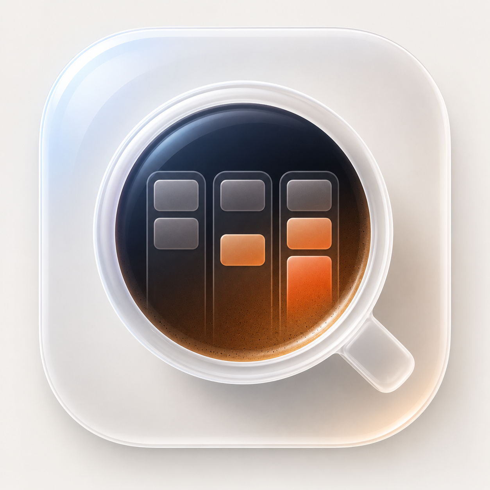

<p align="center">
  
</p>

<h1 align="center">Progresso</h1>

<p align="center"><em>Like espresso, but for progress.</em></p>

<p align="center">
A native macOS kanban board for freelancers and small agencies —<br/>
where every ticket is a plain <strong>markdown file</strong> in a folder you own.
</p>

---

## Why

Client work tools want to own your data. Progresso doesn't: the "database" is a folder
of `.md` files with YAML frontmatter. Point it at a folder in your Obsidian vault (or
any folder), and you get a fast kanban UI on top of files you can read, grep, sync,
back up, and edit from anywhere. Edit a card in the app or the file in your editor —
same data, updated live.

## Features

- **Boards are folders** — add any folder; ⌘1–⌘9 to switch. Sub-folders become pages
  ("books") inside a board.
- **Three ticket kinds** — client jobs (contract, amount, paid/unpaid), content
  (platforms, filming/publish dates), and tasks (priority) — each with its own card look.
- **Money, answered at a glance** — outstanding, overdue (due-date aware, red),
  collected this month, who-owes-what, expenses, and net. All derived from your tickets;
  never a separate spreadsheet.
- **Live sync** — FSEvents watches the folder; external edits (Obsidian, scripts, phone)
  appear on the board in ~2 s. Unknown statuses land in a virtual "Unsorted" column
  instead of disappearing. Unknown frontmatter keys round-trip untouched.
- **Git-backed shared boards** — any board folder that's a git repo auto-commits, pulls
  and pushes (debounced, periodic, on focus). "Clone Shared Board…" sets a teammate up
  in one paste. Commit history shows who moved what.
- **Dashboard** — P/L stat tiles, open tickets by kind × column, and a 14-day
  deadline/overdue list.
- **Expense log** — money out lives next to money in, per board.
- **Menu-bar quick add** — capture a client job, content idea, or task into any board
  without switching apps.
- **Light & dark**, drag & drop, per-board custom columns, search, client/tag filters.

## Install / build

Requires macOS 14+ and a full Xcode toolchain (SwiftUI macros don't compile under bare
Command Line Tools).

```bash
git clone https://github.com/cetijunior/progresso.git
cd progresso
./make-app.sh        # builds Progresso.app and installs it to /Applications
```

Or during development: `swift run` (with `DEVELOPER_DIR` pointing at your Xcode), or
open `Package.swift` in Xcode and hit Run.

First launch: **Add Board Folder…** and point it at any folder. Progresso creates a
`Tickets/` sub-folder and a `board-config.json` (your columns) on first use.

## The data format

One ticket = one file. That's the whole schema:

```markdown
---
id: skyline-website
title: "Skyline Cafe: website + booking"
client: Skyline Cafe
type: paid
amount: 800
currency: EUR
paid: false
status: working
due: 2026-07-15
contract: project
tags: [web, design]
created: 2026-07-06
---

Landing page, menu, table booking.

- Hero shots from Tuesday's photo session []
- Booking flow copy []
```

`status:` is the column. Drag the card, and that one line changes. Content tickets add
`kind: content`, `platforms:`, `publish_date:`; tasks add `kind: task`, `priority:`.
Anything else you put in the frontmatter is preserved verbatim.

```
My Board/
├── board-config.json   # columns
├── Tickets/*.md        # one file per ticket
└── Expenses/*.md       # optional, one file per expense
```

## Contributing

Issues and PRs welcome. The codebase is small (~3.5k lines of SwiftUI, one dependency —
[Yams](https://github.com/jpsim/Yams)), and `Sources/Progresso/` is organized by view.
A few hard-won invariants to respect (they've each caused real bugs):

- One top-level `ActiveSheet` enum per window — never stack multiple `.sheet` /
  per-row `confirmationDialog` modifiers (the last one silently wins).
- Editor fields bind to per-field `@State` scalars, never straight into a struct
  (keystroke-driven re-renders steal focus mid-typing).
- Unknown frontmatter keys and note bodies must round-trip untouched.

## License

[MIT](LICENSE)
